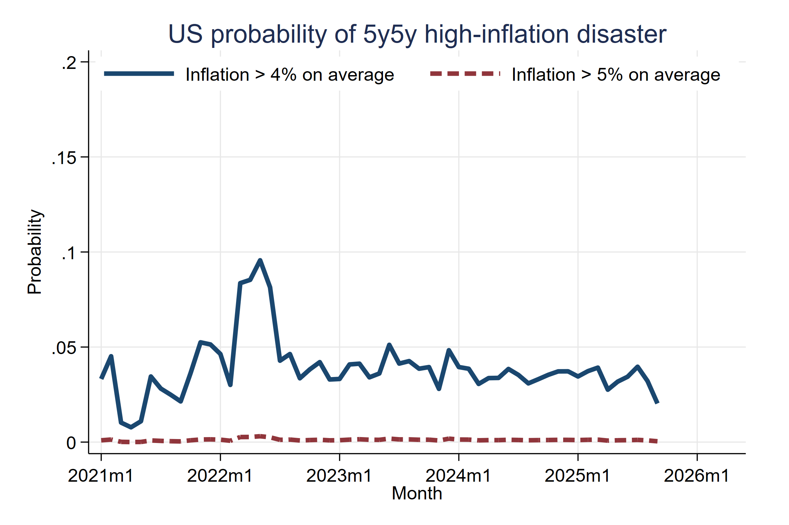
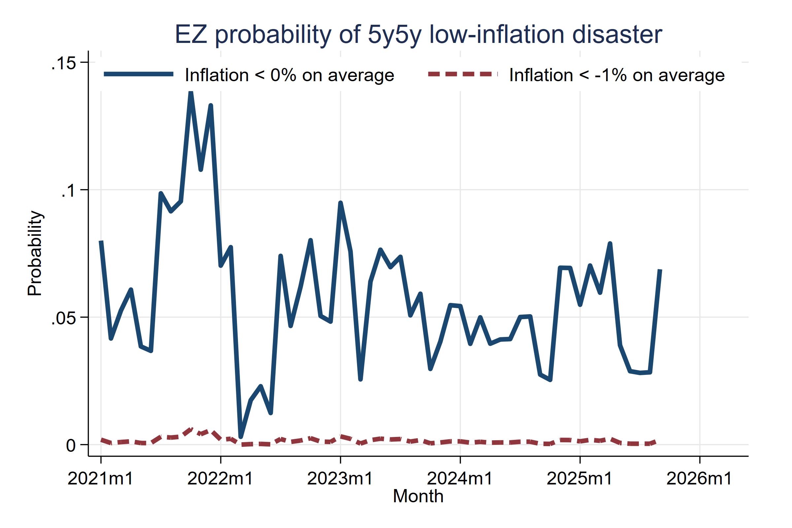
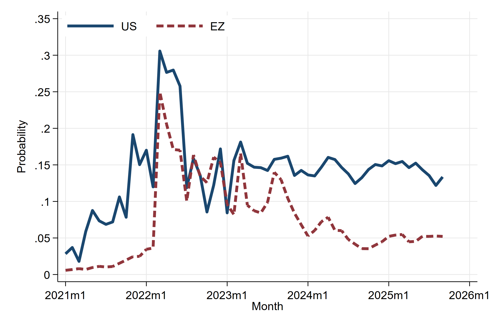
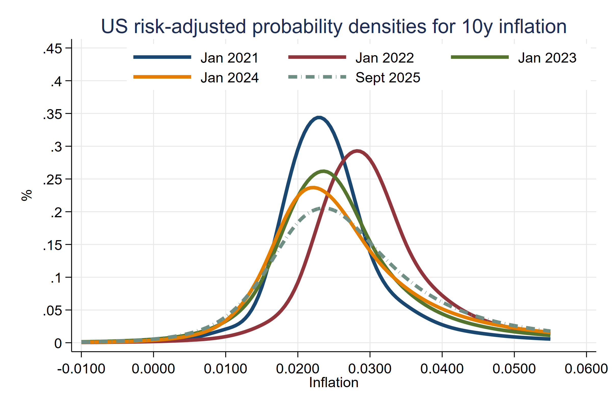

.
# Summary
The prices of inflation options give the cost of insuring against extreme events. They reveal the probability of these events as perceived by market participants. However, to construct probabilities of inflation disasters at the conventional 5-year-5-year horizon, the standard option pricing formulas have to be modified in three ways: to account for the erosion of the real value of the options' payoff, to account for the forward 5-year ahead starting horizon, and to account for the compensation for inflation risk. Below are data and figures for the probabilities of inflation disasters, making these adjustments. The data starts in January of 2011 and refers to US and EA inflation. This dataset can be **freely used** by other researchers.

The dataset will be updated regularly to reflect the latest data.
- **Vintage 1:** The dataset was first released in April of 2022 to cover probabilities until February 2022. 
- **Vintage 2:** The dataset was updated in October 2023 to cover probabilities until August 2023. 
- **Vintage 3:** The dataset was updated in August 2024 to cover probabilities until April 2024. This also came with a re-estimation of the model for horizon and risk, leading to (small) differences in previous probabilities.
- **Vintage 4:** The dataset was updated in December 2024 to cover probabilities until October 2024. 
- **Vintage 5:** The dataset was updated in May 2025 to cover probabilities until April 2025. 
- **Vintage 6:** The dataset was updated in October 2025 to cover probabilities until September 2025. 

---

# Authors and Reference:
[How Likely Is an Inflation Disaster?](https://r2rsquaredlse.github.io/web-lines/25-infdis.pdf) (2025), Review of Financial Studies, forthcoming. 
[bibtex](https://personal.lse.ac.uk/reisr/papers/25-infdis-bib.bib)
- [Jens Hilscher](https://hilscher.ucdavis.edu)
- [Alon Raviv](https://mba.biu.ac.il/en/raviv)
- [Ricardo Reis](https://www.r2rsquared.com/)
- Acknowledgments: Daniel Albuquerque, Marina Feliciano, Seyed Mahdi Hosseini, Rui Sousa, Nicholas Tokay, and Borui Zhu provided excellent research assistance.

---

# Probabilities of disaster
Download in Stata dta format:
- [United States](USwestimates.dta)
- [Euro Area](EZwestimates.dta)

---

# Variables
The data are time series for different inflation disaster probabilities

<table>
  <tr style="background-color: #d4f4d3;">
    <th style="border: 2px solid #68b684; padding: 8px;">Column</th>
    <th style="border: 2px solid #68b684; padding: 8px;">Description</th>
  </tr>
  <tr style="background-color: #f5f5f5;">
    <td style="border: 2px solid #68b684; padding: 8px;"><code>date_ym</code></td>
    <td style="border: 2px solid #68b684; padding: 8px;">Date year-month</td>
  </tr>
  <tr style="background-color: #d4f4d3;">
    <td style="border: 2px solid #68b684; padding: 8px;"><code>date_stata</code></td>
    <td style="border: 2px solid #68b684; padding: 8px;">Date in Stata format</td>
  </tr>
  <tr style="background-color: #f5f5f5;">
    <td style="border: 2px solid #68b684; padding: 8px;"><code>higher4_5y5y</code></td>
    <td style="border: 2px solid #68b684; padding: 8px;">Baseline estimates, more than 4% </td>
  </tr>
  <tr style="background-color: #d4f4d3;">
    <td style="border: 2px solid #68b684; padding: 8px;"><code>higher5_5y5y</code></td>
    <td style="border: 2px solid #68b684; padding: 8px;">Baseline estimates, more than 5%</td>
  </tr>
  <tr style="background-color: #f5f5f5;">
    <td style="border: 2px solid #68b684; padding: 8px;"><code>lower0_5y5y</code></td>
    <td style="border: 2px solid #68b684; padding: 8px;">Baseline estimates, less than 0%</td>
  </tr>
  <tr style="background-color: #d4f4d3;">
    <td style="border: 2px solid #68b684; padding: 8px;"><code>lowerm1_5y5y</code></td>
    <td style="border: 2px solid #68b684; padding: 8px;">Baseline estimates, less than -1%</td>
  </tr>
  <tr style="background-color: #f5f5f5;">
    <td style="border: 2px solid #68b684; padding: 8px;"><code>zc_higher4_5y</code></td>
    <td style="border: 2px solid #68b684; padding: 8px;">No horizon adjustment, higher than 4%, 5 year horizon</td>
  </tr>
  <tr style="background-color: #d4f4d3;">
    <td style="border: 2px solid #68b684; padding: 8px;"><code>zc_higher5_5y</code></td>
    <td style="border: 2px solid #68b684; padding: 8px;">No horizon adjustment, higher than 5%, 5 year horizon</td>
  </tr>
  <tr style="background-color: #f5f5f5;">
    <td style="border: 2px solid #68b684; padding: 8px;"><code>zc_lower0_5y</code></td>
    <td style="border: 2px solid #68b684; padding: 8px;">No horizon adjustment, lower than 0%, 5 year horizon</td>
  </tr>
  <tr style="background-color: #d4f4d3;">
    <td style="border: 2px solid #68b684; padding: 8px;"><code>zc_lowerm1_5y</code></td>
    <td style="border: 2px solid #68b684; padding: 8px;">No horizon adjustment, lower than -1%, 5 year horizon</td>
  </tr>
  <tr style="background-color: #f5f5f5;">
    <td style="border: 2px solid #68b684; padding: 8px;"><code>zc_higher4_10y</code></td>
    <td style="border: 2px solid #68b684; padding: 8px;">No horizon adjustment, higher than 4%, 10 year horizon</td>
  </tr>
  <tr style="background-color: #d4f4d3;">
    <td style="border: 2px solid #68b684; padding: 8px;"><code>zc_higher5_10y</code></td>
    <td style="border: 2px solid #68b684; padding: 8px;">No horizon adjustment, higher than 5%, 10 year horizon</td>
  </tr>
  <tr style="background-color: #f5f5f5;">
    <td style="border: 2px solid #68b684; padding: 8px;"><code>zc_lower0_10y</code></td>
    <td style="border: 2px solid #68b684; padding: 8px;">No horizon adjustment, lower than 0%, 10 year horizon</td>
  </tr>
  <tr style="background-color: #d4f4d3;">
    <td style="border: 2px solid #68b684; padding: 8px;"><code>zc_lowerm1_10y</code></td>
    <td style="border: 2px solid #68b684; padding: 8px;">No horizon adjustment, lower than -1%, 10 year horizon</td>
  </tr>
</table>

---

# Latest Figures (from 01/20 to 09/25)

## Main estimates, high inflation, US

Probability that inflation is above 4% (5%) on average in five years for five years (so, e.g., estimate in September 2025 is for annualized inflation between September 2030 and September 2035.

---

## Main estimates, high inflation, EA

Probability that inflation is above 4% (5%) on average in five years for five years (so, e.g., estimate in September 2025 is for annualized inflation between September 2030 and September 2035.)

---

## Main estimates, deflation, US

Probability that inflation is below 0% (-1%) on average in five years for five years (so, e.g., estimate in September 2025 is for annualized inflation between September 2030 and September 2035.)

---

## Main estimates, deflation, EA

Probability that inflation is below 0% (-1%) on average in five years for five years (so, e.g., estimate in September 2025 is for annualized inflation between September 2030 and September 2035).

---

## Shorter 5-year horizon, US and EA

Probability that inflation is above 4% (5%) on average over the next five years (so, e.g., estimate in September 2025 is for annualized inflation between September 2025 and September 2030).

---

## Densities for 10-year horizon, without risk adjustment, US
 

Probability densities for inflation, on average over next 10 years (starting from date in label), including risk compensation (would only coincide with actual probabilities if investors were risk neutral).

---

## Densities for 10-year horizon, without risk adjustment, EA
 

Probability densities for inflation, on average over next 10 years (starting from date in label), including risk compensation (would only coincide with actual probabilities if investors were risk neutral).

---

# Usage
Please cite if use, and e-mail the authors with suggested corrections.

