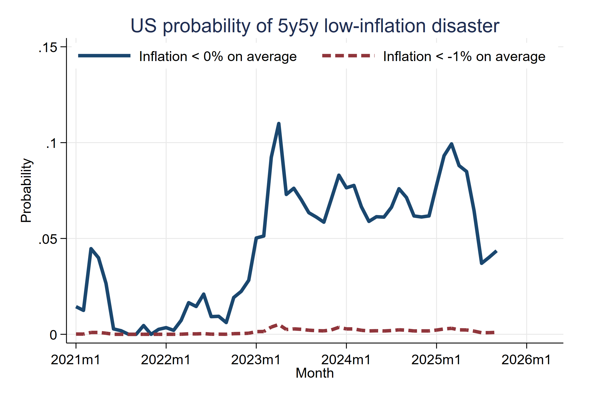
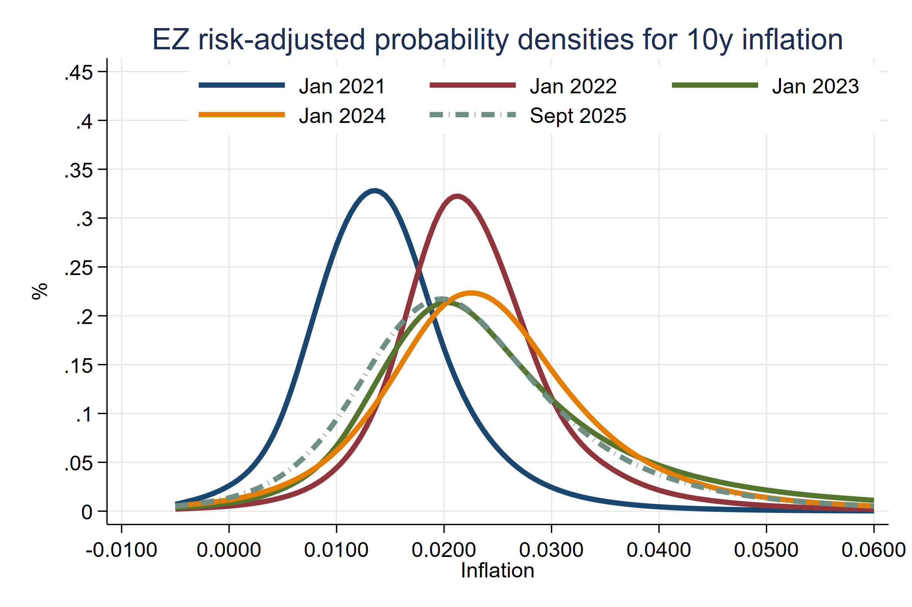

.
# Summary
The prices of inflation options give the cost of insuring against extreme events. They reveal the probabilitiy of these events as perceived by market participants. However, to extract these probabilities, the standard formula for option pricing formula have to be modified in three ways: to account for the erosion of the real valaue of the options' payoff, to account for the 5-year ahead starting horizon, and to account for compensation for inflation risk. Below are the data and figures for the probabilities of inflation disasters, making some or all of these adjustments. The data starts in January of 2011 and refers to US and EA inflation. This dataset can be **freely used** by other researchers.

The dataset will be updated regularly to reflect the latest data.
- **Vintage 1:** The dataset was fist released in April of 2022 to cover probabilities until February 2022. 
- **Vintage 2:** The dataset was updated in October 2023 to cover probabilities until August 2023. 
- **Vintage 3:** The dataset was updated in June 2024 to cover probabilities until April 2024. 

---

# Authors and Reference:
[How Likely Is an Inflation Disaster?](https://r2rsquaredlse.github.io/web-lines/infdis.pdf) (2022), CEPR discussion paper 17224. 
[bibtex](https://personal.lse.ac.uk/reisr/papers/99-infdis-bib.bib)
- [Jens Hilscher](https://hilscher.ucdavis.edu)
- [Alon Raviv](https://mba.biu.ac.il/en/raviv)
- [Ricardo Reis](https://www.r2rsquared.com/)
- Acknowledgments: Daniel Albuquerque, Marina Feliciano, Seyed Mahdi Hosseini, Anna Pilipentseva, Rui Sousa, and Borui Zhu provided excellent research assistance.

---

# Probabilities of disaster
Download in Stata dta format:
- [United States](USwesttimates.dta)
- [Euro Area](EZwestimates.dta)

---

# Variables
The data is at the agreement level: by date and duration (2000-23), by source currency (USD,EUR, RMB, others), by type (bilateral or multilateral), by funding structure (pooled or
by individual bank), by counterparties (central banks), and by some terms (like collateral).

<table>
  <tr style="background-color: #d4f4d3;">
    <th style="border: 2px solid #68b684; padding: 8px;">Column</th>
    <th style="border: 2px solid #68b684; padding: 8px;">Description</th>
  </tr>
  <tr style="background-color: #f5f5f5;">
    <td style="border: 2px solid #68b684; padding: 8px;"><code>date_ym</code></td>
    <td style="border: 2px solid #68b684; padding: 8px;">Date year-month</td>
  </tr>
  <tr style="background-color: #d4f4d3;">
    <td style="border: 2px solid #68b684; padding: 8px;"><code>date_stata</code></td>
    <td style="border: 2px solid #68b684; padding: 8px;">Date in Stata format</td>
  </tr>
  <tr style="background-color: #f5f5f5;">
    <td style="border: 2px solid #68b684; padding: 8px;"><code>higher4_5y5y</code></td>
    <td style="border: 2px solid #68b684; padding: 8px;">Baseline estimates, more than 4% </td>
  </tr>
  <tr style="background-color: #d4f4d3;">
    <td style="border: 2px solid #68b684; padding: 8px;"><code>higher5_5y5y</code></td>
    <td style="border: 2px solid #68b684; padding: 8px;">Baseline estimates, more than 5%</td>
  </tr>
  <tr style="background-color: #f5f5f5;">
    <td style="border: 2px solid #68b684; padding: 8px;"><code>lower0_5y5y</code></td>
    <td style="border: 2px solid #68b684; padding: 8px;">Baseline estimates, less than 0%</td>
  </tr>
  <tr style="background-color: #d4f4d3;">
    <td style="border: 2px solid #68b684; padding: 8px;"><code>lowerm1_5y5y</code></td>
    <td style="border: 2px solid #68b684; padding: 8px;">Baseline estimates, less than -1%</td>
  </tr>
  <tr style="background-color: #f5f5f5;">
    <td style="border: 2px solid #68b684; padding: 8px;"><code>zc_higher4_5y</code></td>
    <td style="border: 2px solid #68b684; padding: 8px;">No horizon adjustment, higher than 4%, 5 year horizon</td>
  </tr>
  <tr style="background-color: #d4f4d3;">
    <td style="border: 2px solid #68b684; padding: 8px;"><code>zc_higher5_5y</code></td>
    <td style="border: 2px solid #68b684; padding: 8px;">No horizon adjustment, higher than 5%, 5 year horizon</td>
  </tr>
  <tr style="background-color: #f5f5f5;">
    <td style="border: 2px solid #68b684; padding: 8px;"><code>zc_lower0_5y</code></td>
    <td style="border: 2px solid #68b684; padding: 8px;">No horizon adjustment, lower than 0%, 5 year horizon</td>
  </tr>
  <tr style="background-color: #d4f4d3;">
    <td style="border: 2px solid #68b684; padding: 8px;"><code>zc_lowerm1_5y</code></td>
    <td style="border: 2px solid #68b684; padding: 8px;">No horizon adjustment, lower than -1%, 5 year horizon</td>
  </tr>
  <tr style="background-color: #f5f5f5;">
    <td style="border: 2px solid #68b684; padding: 8px;"><code>zc_higher4_10y</code></td>
    <td style="border: 2px solid #68b684; padding: 8px;">No horizon adjustment, higher than 4%, 10 year horizon</td>
  </tr>
  <tr style="background-color: #d4f4d3;">
    <td style="border: 2px solid #68b684; padding: 8px;"><code>zc_higher5_10y</code></td>
    <td style="border: 2px solid #68b684; padding: 8px;">No horizon adjustment, higher than 5%, 10 year horizon</td>
  </tr>
  <tr style="background-color: #f5f5f5;">
    <td style="border: 2px solid #68b684; padding: 8px;"><code>zc_lower0_10y</code></td>
    <td style="border: 2px solid #68b684; padding: 8px;">No horizon adjustment, lower than 0%, 10 year horizon</td>
  </tr>
  <tr style="background-color: #d4f4d3;">
    <td style="border: 2px solid #68b684; padding: 8px;"><code>zc_lowerm1_10y</code></td>
    <td style="border: 2px solid #68b684; padding: 8px;">No horizon adjustment, lower than -1%, 10 year horizon</td>
  </tr>
</table>

---

# Latest Figures (until April 2024)

## Main estimates, high inflation, US

Probability that inflation is above 4% (5%) on average in five years for five years (so, e.g., estimate in April 2024 is for annualized inflation between April 2029 and April 2034.

---

## Main estimates, high inflation, EA

Probability that inflation is above 4% (5%) on average in five years for five years (so, e.g., estimate in April 2024 is for annualized inflation between April 2029 and April 2034.)

---

## Main estimates, deflation, US

Probability that inflation is below 0% (-1%) on average in five years for five years (so, e.g., estimate in April 2024 is for annualized inflation between April 2029 and April 2034.)

---

## Main estimates, deflation, EA

Probability that inflation is below 0% (-1%) on average in five years for five years (so, e.g., estimate in April 2024 is for annualized inflation between April 2029 and April 2034).

---

## Without a horizon adjustment, US and EA

Probability that inflation is above 4% (5%) on average over the next five years (so, e.g., estimate in April 2024 is for annualized inflation between April 2024 and April 2029).

---

## Densities, without horizon or risk adjustment, US
 

Probability densities for inflation, on average over next years (starting form date in label), including risk compensation (would only coincide with actual probabilities if investors were risk neutral).

---

## Densities, without horizon or risk adjustment, EA
 

Probability densities for inflation, on average over next years (starting form date in label), including risk compensation (would only coincide with actual probabilities if investors were risk neutral).

---

# Usage
Please cite if use, and e-mail the authors with suggested corrections.

